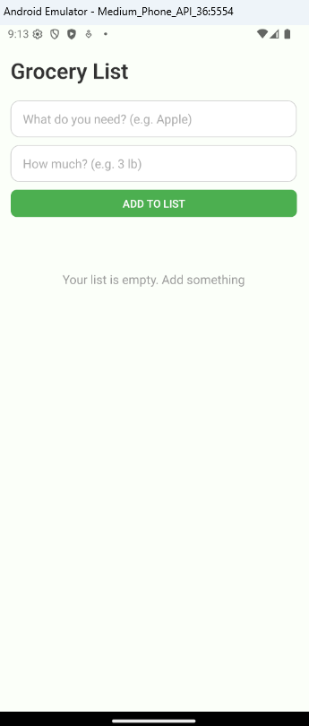
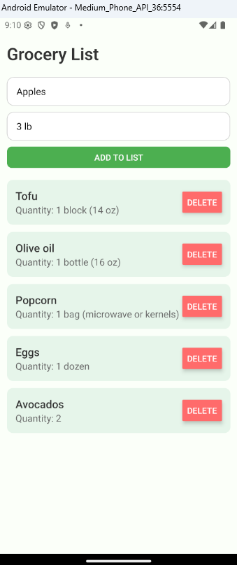
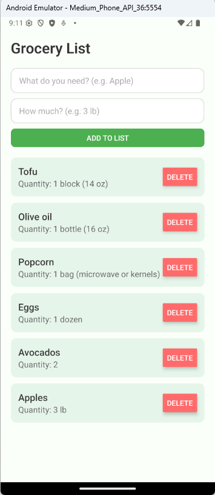
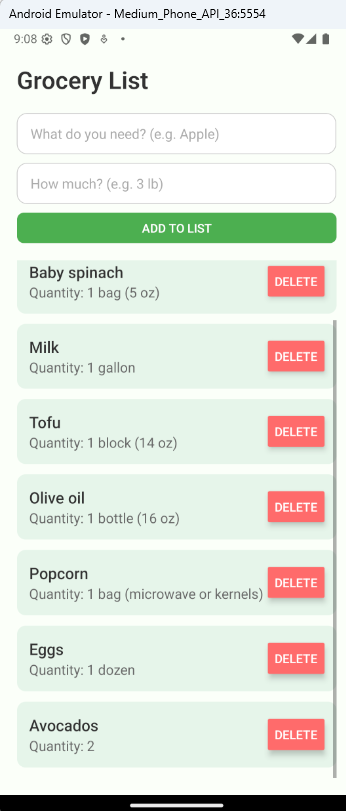
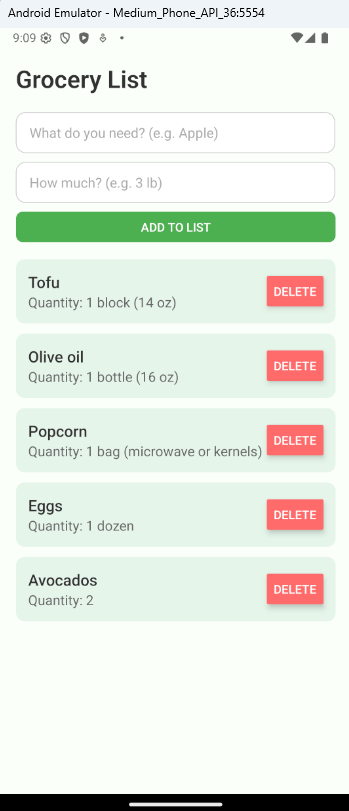
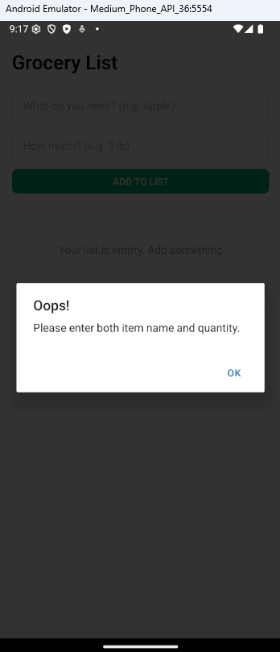

# 📘 INFO670 Assignment 2 — "Grocery List"

---

## Design and Purpose

This mobile app is a simple and easy-to-use **Grocery List Manager** built with **React Native**. It's designed to help users — whether students, parents, or anyone else — quickly jot down the items they need to buy, along with quantities, ensuring nothing gets forgotten during a shopping trip.

---

## Basic Use

### Adding Items

1. Open the app and enter the name of the grocery item (e.g., "Apples").
2. Enter the quantity of the item (e.g., "2 lbs").
3. Press the **"Add to List"** button to add the item to your grocery list.

### Deleting Items

- To remove an item, simply tap the **"Delete"** button next to the item in your list.

### Error Handling

- If either the item name or quantity is left blank, an alert will pop up to notify you to fill in both fields before adding the item.

---

## Screenshots

| Home Screen                                        | Adding an Item                                             | Item Added                                                     | List with Items (Scrollable)                                  | Item Deletion (view after deleting items)                     | Error Handling                                       |
| -------------------------------------------------- | ---------------------------------------------------------- | -------------------------------------------------------------- | ------------------------------------------------------------- | ------------------------------------------------------------- | ---------------------------------------------------- |
|  |  |  |  |  |  |

---
