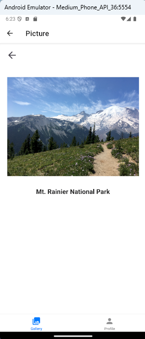

# 📘 INFO670 Assignment 3 — "Gallery App"

---

## Design and Purpose

A simple React Native application that allows users to view a photo gallery and manage their personal profile.

---

## Features

- **Gallery View**: Browse a curated collection of beautiful national park images displayed in a responsive 2-column grid.
- **Picture Viewer**: Tap an image to view it fullscreen with a clear caption and easy back navigation.
- **Profile Form**: Enter and update personal details including name, email, gender (via radio buttons), and major (via dropdown).
- **Persistent Storage**: Profile data is saved locally using `AsyncStorage`, so information persists across app restarts.
- **Form Validation**: Real-time validation with helpful error messages for required fields and correct email formatting.

---

## Screenshots

| Gallery View                                             | Picture Viewer                                                  | Profile Form                                                  | Validation Errors                                                 | Save Confirmation                                               |
| -------------------------------------------------------- | --------------------------------------------------------------- | ------------------------------------------------------------- | ----------------------------------------------------------------- | --------------------------------------------------------------- |
|  |  |  |  |  |

---
